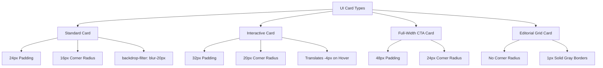

# 4AT — UI, Design System & Page Structure Specifications

This document serves as the comprehensive design and structural reference for **4AT (Nova AI)**. It details the typography, layout constraints, card specifications, color systems, interactive states, and page-by-page section blueprints to enable any designer or developer to easily understand and replicate the application's structure.

---

## 1. Visual Aesthetics & Theme System

The application is designed around a **premium, immersive tech aesthetic** that shifts dynamically based on user interaction (scroll positions) and page intent.

### Dynamic Theme Shifts (Home Page)
The Home Page employs a dynamic scroll-listener that changes the global background and text colors depending on which section is active:
* **Dark State (Default)**:
  * **Background**: Linear gradient from Deep Violet to Indigo/Teal.
    * `linear-gradient(135deg, #0D1227 0%, #161D34 40%, #24304F 70%, #2F4F80 100%)`
  * **Foreground Text**: Pure White / Muted Indigo Grays.
  * **Glow Effects**: Fixed overlay background containing glowing orbs:
    * *Orb 1 (Violet)*: 420px x 420px blur orb (`rgba(124,58,237,.35)`) positioned top-left (`top: -120px; left: -90px`).
    * *Orb 2 (Blue)*: 460px x 460px blur orb (`rgba(14,165,233,.25)`) positioned mid-right (`top: 40%; right: -130px`).
    * *Orb 3 (Teal)*: 400px x 400px blur orb (`rgba(20,184,166,.2)`) positioned bottom-center (`bottom: 0; left: 33%`).
* **Light State (Active Sections)**:
  * **Triggered by Sections**: `services`, `journey`, `work`, `features-grid`, `client-voices`, `blog`.
  * **Background**: Neutral warm gray (`#f5f5f3`).
  * **Foreground Text**: `#000000` (Deep off-black).

### Fixed Editorial Theme (About Page)
The About Page uses a high-end editorial grid layout resembling a physical magazine:
* **Background**: Off-white/neutral light gray (`#f4f4f4` / `#f3f3f3`).
* **Accent Background**: Dark columns (`#050505` / `#000000`) for specific contrast sections.
* **Borders**: Sharp `#dbdbdb` grid-lines separating columns and sections (using `gap-px` layout dividers).

---

## 2. Typography & Hierarchy

### Desktop Sizing (min-width: 768px)
| Typography Style | Tailwind CSS Class / CSS Rule | Font Size | Line Height | Tracking / Letter Spacing | Font Weight | Usage |
| :--- | :--- | :--- | :--- | :--- | :--- | :--- |
| **Super Heading** | `clamp(4.5rem, 9.5vw, 10.5rem)` | Variable (72px to 168px) | `0.85` | `tracking-tighter` | `font-black` (900) | Editorial Hero elements |
| **Hero Title** | `text-7xl` | `4.5rem` (72px) | `leading-none` (1.1) | `tracking-tight` (-0.02em) | `font-extrabold` (800) | Hero section headers |
| **Section H1** | `text-5xl` | `3.0rem` (48px) | `leading-tight` (1.2) | `tracking-tight` (-0.015em) | `font-bold` (700) | Primary section title |
| **Section H2** | `text-4xl` | `2.25rem` (36px) | `leading-snug` (1.3) | `tracking-tight` (-0.01em) | `font-bold` (700) | Secondary subtitles |
| **Subsection H3**| `text-2xl` | `1.50rem` (24px) | `leading-normal` (1.4)| `tracking-normal` (0) | `font-semibold` (600) | Group or card titles |
| **Body Large** | `text-lg` | `1.125rem` (18px)| `leading-relaxed` (1.6)| `tracking-normal` (0) | `font-normal` (400) | Hero intros, lead paragraphs |
| **Body Normal** | `text-base` | `1.0rem` (16px) | `leading-normal` (1.5)| `tracking-normal` (0) | `font-normal` (400) | Standard paragraphs |
| **Small Copy** | `text-sm` | `0.875rem` (14px)| `leading-tight` (1.4) | `tracking-wide` (0.02em) | `font-medium` (500) | Metadata, tag labels |
| **Micro Labels** | `text-[10px]` / `text-[11px]` | 10px / 11px | `leading-none` | `tracking-widest` | `font-bold` (700) / `font-black` (900) | Overlapping tags, category marks |

### Mobile Sizing
| Typography Style | Tailwind CSS Class / CSS Rule | Font Size | Line Height | Font Weight |
| :--- | :--- | :--- | :--- | :--- |
| **Hero Title** | `text-4xl` | `2.25rem` (36px) | `leading-none` (1.1) | `font-extrabold` (800) |
| **Section H1** | `text-3xl` | `1.875rem` (30px)| `leading-tight` (1.2) | `font-bold` (700) |
| **Subsection H3**| `text-xl` | `1.25rem` (20px) | `leading-snug` (1.35) | `font-semibold` (600) |
| **Body Normal** | `text-sm` | `0.875rem` (14px)| `leading-normal` (1.5)| `font-normal` (400) |

---

## 3. Layout & Section Measurements

To maintain symmetry and consistency, all layouts strictly adhere to the following spacing scales:

### Max Container Widths
* **Standard Page Container**: Max-width of `1280px` (`max-w-7xl px-4 md:px-8 mx-auto`).
* **Focused Content Container**: Max-width of `1024px` (`max-w-5xl px-4 md:px-6 mx-auto`).
* **Editorial Column Grid**: Spans full screen width (`w-full`) utilizing borders instead of page containers.

### Vertical Spacing & Dividers
* **Section-to-Section Padding**:
  * Desktop: `py-24` to `py-32` (`96px` to `128px` top/bottom).
  * Mobile: `py-12` to `py-16` (`48px` to `64px` top/bottom).
* **Grid Spacing (Gap System)**:
  * Large Sections: `gap-6` (24px) or `gap-8` (32px) grid gap on desktop; collapses to `gap-4` (16px) on mobile.
  * Border Divider Grid: `gap-px` (1px background color bleeding through borders).

---

## 4. UI Components & Card Specifications

The components utilize a combination of clean, raw border layouts and modern glassmorphism panels.

### Card Types & Layout Specifications



#### 1. Standard Content Card (e.g., Services, Blog Posts)
* **Padding**: `p-6` (`24px`) even padding on all sides.
* **Corner Radius**: `rounded-2xl` (`16px`).
* **Background**: `bg-white/3` / `rgba(255, 255, 255, 0.03)` with `backdrop-filter: blur(20px)`.
* **Border**: `border border-white/8%` (`border-border`).
* **Services First Card Accent**: Overridden with background `rgba(56, 189, 248, 0.3)` and border `border-blue-300/80` spanning both front and back card containers. The front side features the custom ecosystem diagram image sitting frameless, positioned absolute (`bottom-0 left-0 right-0 h-[220px]`) to sit flush against the absolute bottom and sides, using `object-fill` to stretch and fit completely, and using `mix-blend-screen` to merge outlines with the background.

#### 2. Interactive / Hover-State Card (e.g., Features Grid)
* **Padding**: `p-8` (`32px`) desktop, `p-6` (`24px`) mobile.
* **Corner Radius**: `rounded-[20px]` (`20px`).
* **Transitions**: `transition-all duration-300 ease-out`.
* **Hover Interaction**:
  * Translate vertically upward: `-translate-y-1` (`-4px`).
  * Border shift: increases opacity from `border-white/8%` to `border-white/20%`.
  * Background shift: Radial gradient glow emerges.

#### 3. Hero / Call to Action Card (Full Width)
* **Padding**: `p-12` (`48px`) desktop, `p-6` (`24px`) mobile.
* **Corner Radius**: `rounded-3xl` (`24px`).
* **Background**: Dual-tone gradient overlay (`bg-gradient-to-br from-indigo-900/30 to-violet-900/30`).

#### 4. Editorial Team & Partner Cards (About Page)
* **Padding**: `p-8` (`32px`) even.
* **Corner Radius**: `rounded-none` (`0px` / raw square corners).
* **Border**: `border border-[#dbdbdb]` on light theme or `border border-zinc-900` on dark theme.
* **Height**: Fixed height layouts (`h-[300px]` / `min-h-[290px]`) for neat grid alignment.

---

## 5. Blueprint: Page Structures & Components

Here is the exact layout structure of the two primary client entry points.

### A. Home Page Layout Flow (`/`)

The Home Page acts as a single-page storytelling scroll.

```
┌────────────────────────────────────────────────────────┐
│                        Nav Bar                         │ (Sticky Glassmorphism Header)
├────────────────────────────────────────────────────────┤
│                       1. Hero                          │ (Large Typography + Animated Accents)
├────────────────────────────────────────────────────────┤
│                    2. Our Vision                       │ (Clean Text Block + Interactive Canvas)
├────────────────────────────────────────────────────────┤
│                     3. Services                        │ (Light BG Transition + Standard Grid)
├────────────────────────────────────────────────────────┤
│                      4. Results                        │ (Metrics, Numbers & Success Counters)
├────────────────────────────────────────────────────────┤
│                  5. Results Timeline                   │ (Step-by-Step Chronological Showcase)
├────────────────────────────────────────────────────────┤
│                    6. Consulting                       │ (Tailored Corporate Consulting Plans)
├────────────────────────────────────────────────────────┤
│                      7. Academy                        │ (Educational/Training Materials Module)
├────────────────────────────────────────────────────────┤
│                      8. Process                        │ (Interactive Workflow Roadmap Diagram)
├────────────────────────────────────────────────────────┤
│                      9. Clients                        │ (Logo Showcase & Client Testimonials)
├────────────────────────────────────────────────────────┤
│                   10. Client Voices                    │ (Light BG Transition + Testimonial Quotes)
├────────────────────────────────────────────────────────┤
│                  11. Features Grid                     │ (Interactive Cards with Radial Glows)
├────────────────────────────────────────────────────────┤
│                    12. Blog Section                    │ (Latest News & Digital Industry Articles)
├────────────────────────────────────────────────────────┤
│                      13. Contact                       │ (Interactive Form / Consultation Booking)
├────────────────────────────────────────────────────────┤
│                        Footer                          │ (Credits, Map Links & Legal Mentions)
└────────────────────────────────────────────────────────┘
```

1. **Nav**: Sticky transparent header that transforms into frosted glass on scroll. Supports dark/light content matching.
2. **Hero**: Prominent title typography (`text-7xl`) paired with subtext (`text-lg` or `Body Large`), plus double CTA buttons.
3. **Our Vision**: Bold editorial positioning statements that outline the philosophy of AI-driven workflows.
4. **Services**: Grid-based components (`gap-6`) showcasing individual capabilities.
5. **Results**: Highlighted statistics cards displaying high-impact metrics (e.g., efficiency gain percentages, project delivery counts).
6. **Results Timeline**: Vertical timeline representation displaying progress milestones.
7. **Consulting / Academy**: Service deep-dives detailing how teams are integrated and educated.
8. **Process**: Chronological stages (`Process.tsx`) detailing the collaboration framework.
9. **Clients**: Smooth scrolling or stationary grid of logo SVGs representing trusted partners.
10. **Client Voices**: Blockquote testimonials leveraging larger typography weights.
11. **Features Grid**: Layout of interactive hover cards demonstrating specific tooling integrations.
12. **Blog Section**: Three-column article grid (`gap-8`) pointing to individual posts.
13. **Contact**: Form wrapper using standard styling inputs with minimal boundaries.
14. **Footer**: Navigation links, social links, and brand copyright marks.

---

### B. About Page Layout Flow (`/about`)

The About Page uses a structured editorial grid resembling high-end fashion and tech lookbooks.

1. **Nav**: Sticky navigation header aligned to the layout grids.
2. **3-Column Main Grid**:
   * **Left Column (width: `1.1fr`)**: Large "WHO WE ARE" text (`fontSize: clamp(4.5rem, 9.5vw, 10.5rem)`) backed by a multi-colored background light leak.
   * **Center Column (width: `1.2fr`)**: Large full-bleed glitch digital portrait photograph (`glitchPortrait`).
   * **Right Column (width: `0.9fr`)**: Walking team card photograph overlaid next to a compact description block and black-accented "Get Started Now" CTA button.
3. **Full-Bleed Video Section**: High-contrast, autoplaying muted loop (`/assets/1st video.mp4`) spanning full-screen height.
4. **Scroll-Reveal Statement Section**: Dark background section containing a paragraph that dynamically lights up white word-by-word as the user scrolls.
5. **Mission & Vision Grid**:
   * A 4-column layout separated by a 1px border grid (`gap-px`).
   * Contains:
     * *Row 1*: "Our Mission" text block ➔ Mission glitch photo ➔ Centered 4AT Logo ➔ "Our Vision" point list.
     * *Row 2*: Blurred profile study photo ➔ "Let's Work Together" card ➔ "Our Goal" stats block ➔ Projection study photo.
6. **Partners Grid Section**: Clean light-gray grid displaying minimalist cards for brands like Nexter, Syd, Oslo, Nonme, etc.
7. **Growth Timeline Marquee**: Interactive, infinite horizontal-scrolling track that pauses on hover. Alternates between narrative cards and high-contrast projection images.
8. **AI Innovation Team Section**: Dotted-line skill grid showcasing team members (Ethan Parker, Ava Reynolds, Noah Carter, Sarah Brown, Liam Turner) with grayscale portraits that transition to color on hover.
9. **Awards & Nominations Table**: A split layout where the left column displays nomination descriptions and the right displays a chronological grid table showing nominations from Awwwards, Behance, DesignRush, etc.
10. **FAQ Accordion Section**: Interactive accordion interface featuring list items that slide open to display detailed answers inside a warm-gray sidebar panel.
11. **Contact & Footer**: Universal brand endpoints.

---

## 6. Color Tokens Reference

| Variable / Token | HEX Value / Equivalent | OKLCH / CSS Representation | Usage Area |
| :--- | :--- | :--- | :--- |
| **Dark BG Base** | `#0a0e23` | `#0a0e23` (Overrode Tailwind's default black) | Base page backgrounds (Dark) |
| **Dark Elevated BG** | `#141414` / `#161616` | `oklch(0.08 0 0)` | Card backgrounds (Dark) |
| **Border Muted** | `rgba(255, 255, 255, 0.08)` | `oklch(1 0 0 / 8%)` | Glassmorphism borders |
| **Text Primary** | `#ffffff` | `oklch(1 0 0)` | High-contrast headers |
| **Text Secondary**| `#9c9c9c` / `#a1a1a1` | `oklch(0.7 0 0)` | Paragraphs & captions (Dark) |
| **Light BG Base** | `#f5f5f3` / `#f4f4f4` | `oklch(0.97 0 0)` | Base page backgrounds (Light) |
| **Light Grid Line**| `#dbdbdb` / `#e5e5e5` | `oklch(0.88 0 0)` | Structural grid lines |
| **Text Dark Mode**| `#1c1c1c` / `#2a2a2a` | `oklch(0.15 0 0)` | Headings & copy (Light) |
| **Accent Glow Purple**| `#7c3aed` | `oklch(0.58 0.26 302)` | Purple gradient highlights |
| **Accent Glow Teal** | `#00f2fe` | `oklch(0.81 0.17 210)` | Cyan gradient highlights |
